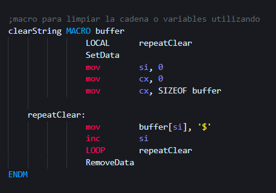
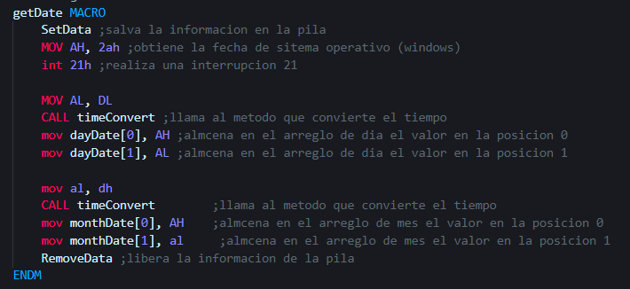
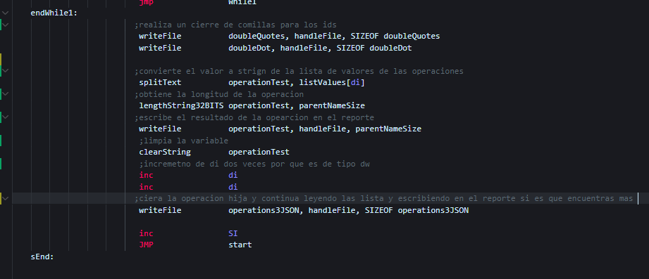

# Manual Tecnico

- [Manual Tecnico](#manual-tecnico)
  - [main.asm](#mainasm)
  - [file.asm](#fileasm)
  - [analyzer.asm](#analyzerasm)
  - [macros.asm](#macrosasm)
  - [Time.asm](#timeasm)
  - [report.asm](#reportasm)

## main.asm

## file.asm

## analyzer.asm

## macros.asm

## Time.asm

## report.asm

