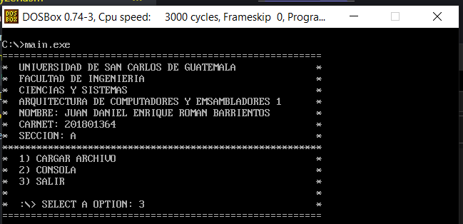
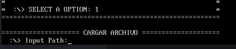
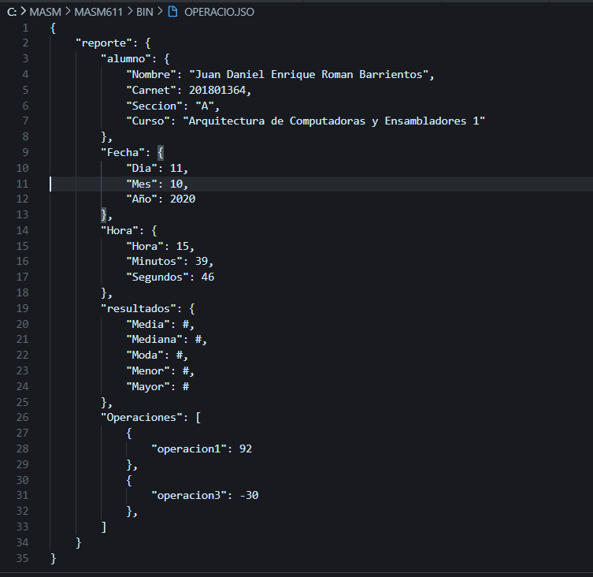

# Manual de Usuario

- [Manual de Usuario](#manual-de-usuario)
  - [Inicio Menu](#inicio-menu)
  - [Cargar Archivo](#cargar-archivo)
  - [Consola](#consola)
  - [Reporte](#reporte)

## Inicio Menu
Interfaz de Incicio donde al usuario se le muestra el siguente menu con diferentes opciones

1. Cargar Archivo
2. Consola
3. Salir

## Cargar Archivo
Al ingresar a este sub-menu se le pedira ingresar una direccion de archivo donde dicho archivo sera analizado para poder realizar sus operaciones o mostras cosas especificas con la Opcion 2 del menu princial 

## Consola
Al ingresar a este menu, el usuario podra ingresar los siguientes comandos.

1. show id: este comando mostrara lo que haya en ese id por ejemplo si se introduce show operacion1, mostrara el resultado de esta operacion.
2. show media: mostrara la media de todas las operaciones.
3. show moda: mostrara la moda de todas las operaciones.
4. show mediana: mostrara la mediana de todas las operaciones
5. show mayor:  mostrara el valor mas mayor de las sub-operaciones del archivo, por ejemplo si el archivo tiene 3 operaciones y de los tres resultados la operacion2 tiene el mayor valor, este sera mostrado en la consola.
6. show menor: mostrar el menor valor de  las sub-operaciones
7. exit: al ingresa este comando volvera al menu principal

## Reporte
Se generada un reporte del archivo analizado, que tendra la siguiente estructura.

El reporte es guardado con el id padre del archivo de entrada y con extension .json, pero en MASM no es posible mas de 3 caracteres, por lo que se guarda en .jso